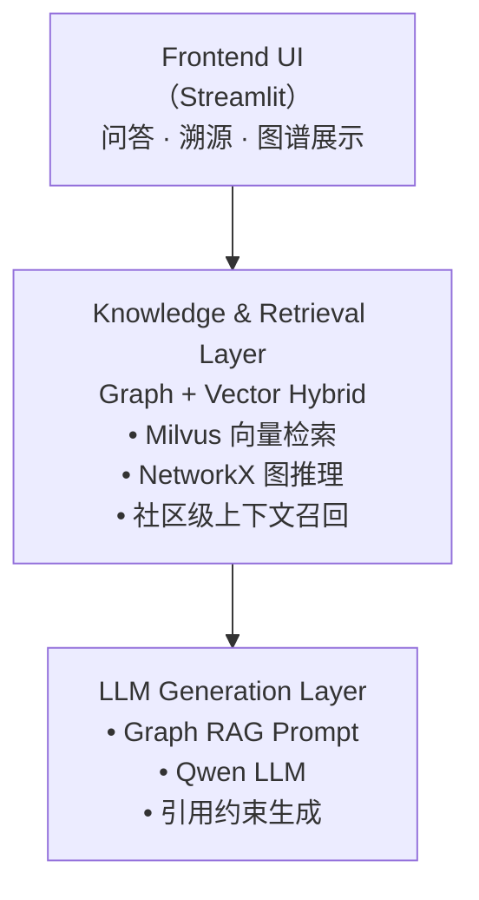
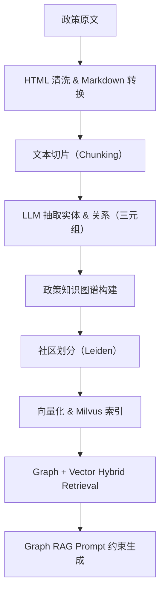
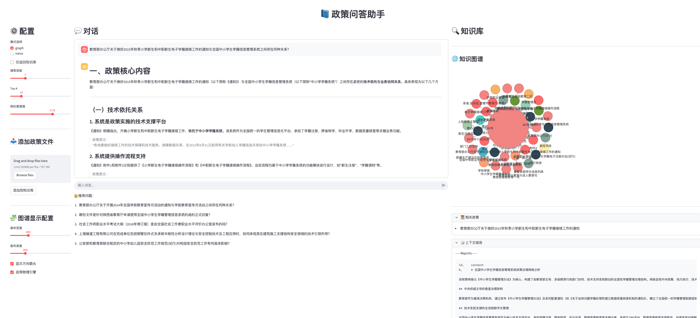

# 🧠 policy-graphrag

> **一个面向政策法规问答场景的 Graph RAG 工程实现，支持多跳推理与可溯源回答**

---

## 🚀 项目简介（Overview）

**policy-graphrag** 是一个面向 **真实政策法规问答场景** 的
**Graph RAG（Graph-based Retrieval-Augmented Generation）工程实现**。

与传统 RAG 主要依赖“相似文本检索”不同，本项目关注的是一个更核心的问题：

> **如何在政策之间的结构化关系网络中进行检索、推理与生成**

在实际政策问答中，常见问题包括：

* ❌ 政策条文表述抽象，大模型容易产生**幻觉**
* ❌ 多政策、多条款之间存在隐含的**逻辑与引用关系**
* ❌ 回答结果缺乏**明确依据与溯源路径**
* ❌ 纯向量 RAG 难以处理 **上下位法 / 依据 / 引用 / 废止** 等结构关系

为此，本项目显式构建 **政策知识图谱（Policy Knowledge Graph, PKG）**，将：

* 政策文本
* 条款结构
* 政策之间的法律与制度关系

统一建模到 **图结构 + 向量检索 + 大模型生成** 的 Graph RAG 框架中，实现：

> ✅ **可检索 · 可推理 · 可溯源** 的政策问答系统

---

## ✨ 核心特性（Key Features）

* 🧠 **Graph RAG 架构**
  在政策关系网络中进行检索与推理，而非简单文本相似度匹配

* 🔗 **多跳政策推理（Multi-hop Reasoning）**
  支持依据链、引用链、上下位法等多跳关系推理

* 📜 **答案可溯源（Traceable Answers）**
  每条结论均可定位到具体政策条款与来源

* 🧩 **结构化政策知识图谱**
  政策不再是文本集合，而是显式的关系网络

* 🖥️ **交互式可视化**
  支持政策图谱、推理路径与溯源信息展示

---

## 🏗️ 系统架构（System Architecture）

系统整体采用 **三层架构设计**：



---

## 🔄 端到端流程（End-to-End Pipeline）



---

## 🧩 核心模块说明（Core Components）

### 1️⃣ 政策语料处理（Policy Corpus Processing）

* **输入格式**：政策原文 HTML
* **处理流程**：

  * HTML 清洗
  * 统一转换为 Markdown
  * 基于语义的 Chunk 切片

📌 **为什么使用 Markdown？**
Markdown 能更好地保留政策条款结构，LLM 对其语义与层级理解明显优于纯文本。

---

### 2️⃣ 实体与关系抽取（LLM-based）

* 使用 **Qwen 系列大模型**
* 通过 Prompt 模板直接生成政策三元组：

```text
(Entity) ——[Relation]——> (Entity)
```

支持的关系类型包括（但不限于）：

* 发布
* 依据
* 适用于
* 配套
* 废止
* 执行

📌 **无需人工规则、无需训练 NER/RE 模型，直接利用大模型的结构化生成能力**

---

### 3️⃣ 政策知识图谱（Policy Knowledge Graph）

* 图引擎：`NetworkX`
* **节点类型**：

  * 政策文件
  * 政策条款
  * 法律依据
  * 发布机构
* **边属性**：

  * 政策关系类型
  * 权重
  * 来源条款（用于溯源）

---

### 4️⃣ 图社区划分（Graph Community Detection）

* 算法：**Leiden**
* 目标：

  * 将大规模政策图划分为主题子图
  * 支持 **社区级上下文召回**

每个社区由 LLM 自动生成 **语义摘要**，作为全局背景信息，避免回答“只见条文，不见体系”。

---

### 5️⃣ 混合检索机制（Hybrid Retrieval）

采用 **向量 + 图结构 + 社区上下文** 的三层联合检索策略：

1. **向量检索（Milvus）**
   → 定位最相关的政策条款或节点

2. **图结构扩展**
   → 基于关系进行多跳推理（依据链 / 引用链）

3. **社区级上下文补充**
   → 引入主题背景，提升回答完整性

---

### 6️⃣ Graph RAG 生成（Generation）

通过严格的 Prompt 约束，确保生成结果可靠：

* ❌ 禁止编造政策内容
* ❌ 禁止超出检索上下文
* ✅ 强制标注引用来源
* ✅ 标注政策效力状态

**输出结果包括**：

* 自然语言回答
* 相关政策条款列表
* 多政策推理路径（可视化）

---

## ⚙️ 环境配置（Environment Setup）

### 运行环境

```bash
Python >= 3.10
pip install -r requirements.txt
```

### `.env` 配置示例

```env
working_dir=./data
embedding_model=bge-small-zh-v1.5
device=cuda
llm_model_name=qwen
llm_api_key=YOUR_API_KEY
llm_base_url=YOUR_BASE_URL
```

详情参考 `.env.example` [env模版](.env.example)

---

## 🚀 快速开始（Quick Start）

### 1️⃣ 构建知识图谱与索引

参考以下 Notebook：

* [政策文件预处理](docs/政策文件预处理.ipynb)
* [Graph RAG 构建流程](docs/GraphRAG的构建.ipynb)

该阶段将完成：

* 文档解析
* 实体关系抽取
* 知识图谱构建
* 社区划分
* 向量索引

---

### 2️⃣ 启动问答系统

```bash
streamlit run streamlit_app.py
```



---

### 3️⃣ 代码结构说明

👉 [Code Details](policy_graphrag/README.md)

---

### 4️⃣ 示例问题（Example Query）

> **“地方政府在教育经费管理中承担哪些职责？”**

系统返回：

* ✅ 综合政策回答
* 📜 精确条款引用
* 🔗 多政策推理路径
* 🧠 关系与依据说明

---

## 🧠 何时选择 Graph RAG？

如果你的应用场景满足以下任一条件：

* 文档之间存在 **明确逻辑或引用关系**
* 需要 **可解释 / 可溯源** 的回答
* 纯向量 RAG 容易断章取义
* 涉及法规 / 政策 / 合规 / 制度类文本

👉 **Graph RAG 通常优于纯向量 RAG**

---    

## 📌 说明（Notes）

* 本项目为**工程研究实现**，非商业产品，灵感来源于 [Microsoft GraphRAG](https://github.com/microsoft/graphrag) 和 [nano-graphrag](https://github.com/gusye1234/nano-graphrag)
* 模型与向量库均可替换
* **Graph RAG 的核心不在模型，而在结构化建模与关系推理**

---

## 📄 License

MIT License

